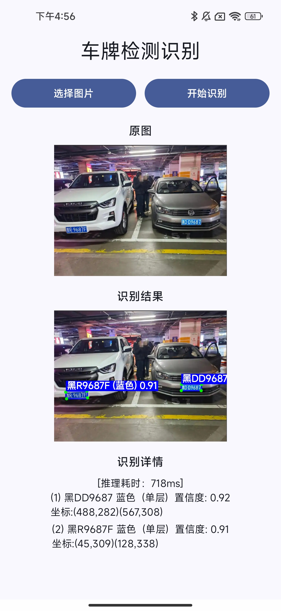
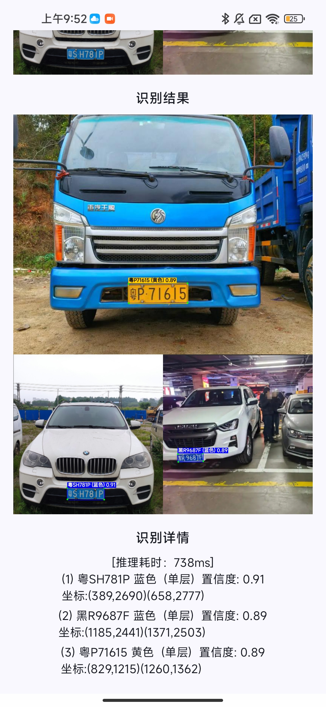

# 车牌检测识别 Android SDK

本项目实现了一套完整的**中国车牌端侧检测与识别解决方案**，可在 Android 设备上离线运行，无需联网或服务器支持。

核心能力：给定一张包含车牌的图片，SDK 自动检测出所有车牌位置，并返回号牌文字（如 `京A12345`）、车牌颜色（蓝/黄/绿/白/黄绿）以及单/双层类型。整个识别过程在设备本地完成，适用于停车场管理、行车记录仪、门禁系统等对隐私或离线能力有要求的场景。

技术实现基于 ONNX Runtime + OpenCV，以 Android Library 模块（`platesdk`）形式提供，配套一个 Jetpack Compose 演示应用（`app`）。

## 效果展示


<p align="center">
  
  &nbsp;&nbsp;
  
</p>


## 功能特性

- **车牌检测**：YOLOv 系列检测模型，输出边界框 + 四角点坐标 + 单/双层类型
- **文字识别**：CTC 序列模型，号牌字符集（含学警港澳新能源等）
- **颜色识别**：基于 HSV 像素统计，支持蓝/黄/白/绿/黄绿（新能源）五种颜色
- **双层车牌**：自动拆分上下层并水平拼接后送入识别模型
- **模型加密**：模型文件以 AES-256-GCM 加密存储于 assets，运行时在内存中解密加载，明文不落盘

## 项目结构

```
plate-recognition-android/
├── app/                          # Demo 应用（Jetpack Compose）
│   └── src/main/java/com/zhouyu/plate/
│       └── MainActivity.kt       # 选图 → 调用 SDK → 绘制检测框
├── platesdk/                     # SDK 库模块
│   └── src/main/java/com/zhouyu/platesdk/
│       ├── PlateRecognitionSDK.kt      # 统一入口（单例）
│       ├── config/PlateConfig.kt       # 全局配置常量
│       ├── model/PlateResult.kt        # 识别结果数据类
│       ├── recognition/
│       │   ├── PlateDetector.kt        # 检测（ONNX 推理 + NMS）
│       │   ├── PlateRecognizer.kt      # 文字识别（ONNX 推理 + CTC 解码）
│       │   ├── PlateColorClassifier.kt # 颜色分类（HSV 像素统计）
│       │   └── CtcDecoder.kt           # CTC 贪心解码
│       ├── security/
│       │   ├── EncryptedModelLoader.kt    # AES-GCM 解密并创建 ONNX Session
│       │   └── ModelKeyProvider.kt.template  # 密钥派生模板（需自行配置）
│       └── utils/
│           ├── ImageUtils.kt           # Letterbox / 透视变换 / 双层拆分
│           └── FileUtils.kt
├── build.gradle.kts
├── settings.gradle.kts
└── gradle/libs.versions.toml
```

## 技术栈

| 组件 | 版本 |
|------|------|
| Kotlin | 2.2.10 |
| Jetpack Compose BOM | 2026.02.01 |
| ONNX Runtime for Android | 1.18.0 |
| OpenCV Android | 4.9.0 |
| Android Gradle Plugin | 9.2.1 |
| 最低 SDK | API 24 (Android 7.0) |
| 目标 SDK | API 36 |
| ABI | arm64-v8a |

## 识别流水线

```
输入 Bitmap
    │
    ▼
[PlateDetector]
  Letterbox 缩放到 640×640（灰色填充）
  BGR→RGB + /255 归一化
  ONNX 推理（输出 cx,cy,w,h,objConf,4角点×2,cls0,cls1）
  置信度过滤（objConf × clsScore > 0.4）
  NMS（IoU 阈值 0.5）
  坐标还原到原图
    │  输出：边界框 + 四角点 + 单/双层类型
    ▼
[ImageUtils.fourPointTransform]
  角点排序（左上→右上→右下→左下）
  warpPerspective 透视变换
    │  输出：正视角车牌 ROI（Mat）
    ▼
[ImageUtils.splitMerge]（仅双层车牌）
  裁剪上层（高度 × 5/12）
  裁剪下层（从高度 × 1/3 起）
  上层缩放至下层尺寸后水平拼接
    │
    ▼
[PlateRecognizer]
  resize 到 168×48
  /255 → 减均值(0.588) → 除标准差(0.193)
  BGR CHW 格式 → ONNX Tensor
  推理（输出 [1, seqLen, numClasses]）
  argmax per timestep
    │
    ▼
[CtcDecoder]
  跳过 blank(0) + 去重复
  查表 PLATE_CHARS 映射字符
    │
    ▼
[PlateColorClassifier]（并行在透视变换后的 ROI 上执行）
  中值滤波（核 7）去噪
  BGR→HSV
  inRange 统计各颜色像素数
  绿色主导 + 黄色占比 > 30% → 黄绿色
    │
    ▼
List<PlateResult>（文字 + 颜色 + 坐标 + 置信度）
```

## 模型加密机制

模型以 AES-256/GCM 加密后存储为 `assets/platesdk/*.onnx.enc`，格式：

```
[magic:4字节] [version:1字节] [IV:12字节] [密文+GCM Tag]
```

密钥由 `partA + packageName + partB + salt` 拼接后 SHA-256 派生，与应用包名绑定。  
解密在内存中完成，`ByteArray` 用后立即清零，模型明文不写入磁盘。

## 性能优化

- Mat → ONNX Tensor 转换使用批量 `mat.get(0, 0, floatArray)` 替代逐像素 JNI 调用，检测预处理从约 123 万次 JNI 调用降为 1 次
- 颜色分类使用 `Core.countNonZero` 替代逐像素遍历
- SDK 为单例，`ReentrantLock` 保证线程安全，ONNX Session 全生命周期复用

## 快速使用

### 初始化SDK

```kotlin
// Application 或 Activity 中
val success = PlateRecognitionSDK.init(context)
```

### 识别

```kotlin
// 在非主线程执行
val results: List<PlateResult> = PlateRecognitionSDK.recognize(bitmap)

for (result in results) {
    println("${result.plateText} ${result.plateColor} (${result.plateType})")
    println("置信度: ${result.detectScore}")
    println("坐标: (${result.x1}, ${result.y1}) - (${result.x2}, ${result.y2})")
}
```

### 释放资源

```kotlin
PlateRecognitionSDK.release()
```

## 配置模型与密钥


### 注意：本仓库**不包含**模型文件和密钥，需要模型文件，请联系作者：2179853437@qq.com

### 1. 配置密钥

```bash
# 复制密钥模板
cp platesdk/src/main/java/com/zhouyu/platesdk/security/ModelKeyProvider.kt.template \
   platesdk/src/main/java/com/zhouyu/platesdk/security/ModelKeyProvider.kt
```

编辑 `ModelKeyProvider.kt`，将 `partA`、`partB`、`salt` 替换为实际密钥字节值。

### 2. 放置加密模型
将加密后的模型文件放置于：

```
platesdk/src/main/assets/platesdk/
├── car_plate_detect.onnx.enc   # 检测模型（加密）
└── plate_rec.onnx.enc          # 识别模型（加密）
```

## 构建运行

```bash
# 确保已完成密钥配置和模型文件放置
./gradlew :app:assembleDebug
# 或直接在 Android Studio 中运行 app 模块
```

## 许可证

MIT License
